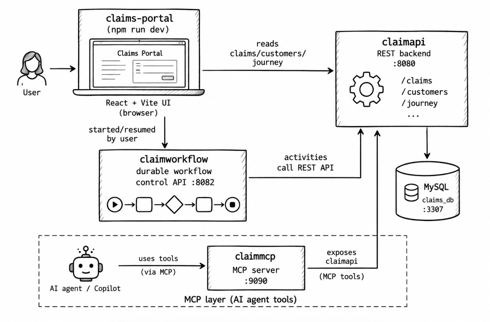

# ClaimProcessor — Amani General Insurance

A demo claims processing system for **Amani General Insurance**, built for **WSO2Con Africa 2026**. It's made up of a
MySQL-backed REST API, a durable workflow engine, an MCP server that exposes the same claim
operations as agent tools, and a React front end that ties it all together.

## Architecture



`claimapi` owns the data and is the only component that talks to MySQL. `claimworkflow` and
`claimmcp` are independent Ballerina services that both call `claimapi`'s REST API rather than
touching the database directly. `claimagent` never calls `claimapi` directly either — its
reasoning loop reaches claim data only through `claimmcp`'s tools — so every component can be
built, run, and deployed separately.

## Components

### 1. `claimapi` — Claims backend REST API

Ballerina HTTP service (package `anupama/claimapi`) backed by MySQL. This is the source of truth
for claims, customers, and each claim's journey/audit trail.

- **Port:** `8080` (configurable via `servicePort`)
- **Key files:** `main.bal` (HTTP services), `db.bal` (MySQL queries + seed/reset data), `types.bal` (domain records)
- **Endpoints:**
  | Method | Path | Description |
  |---|---|---|
  | GET | `/claims` | List all claims |
  | GET | `/claims/{claimId}` | Get a single claim |
  | GET | `/claims/{claimId}/journey` | Get a claim's journey/audit steps |
  | POST | `/claims/{claimId}/request-documents` | Mark documents as requested (mock notification) |
  | POST | `/claims/{claimId}/documents-received` | Record documents the customer submitted |
  | POST | `/claims/{claimId}/decision` | Record an approve/reject decision, with the rationale |
  | POST | `/claims/{claimId}/escalate` | Hand the claim to a human adjuster (status `ESCALATED`) |
  | POST | `/claims/{claimId}/payment` | Process payment for a decided claim |
  | POST | `/claims/{claimId}/reset` | Reset one of the 3 sample claims back to its seed state |
  | GET | `/customers/{customerId}` | Get a customer's contact details |
  | GET | `/claims/health` | Health check |

### 2. `claimworkflow` — Durable claims workflow

Ballerina service (package `anupama/claimworkflow`) built on `ballerina/workflow`, a durable,
Temporal-based workflow engine. It models the end-to-end claim process as a long-running,
resumable workflow:

```
Receive claim → Validate → Check documents
    → [missing?] → request documents → WAIT for external event → resume
    → Process claim (decision + payment) → Notify customer
```

Each activity (`validateClaim`, `checkDocuments`, `requestMissingDocuments`,
`recordDocumentsReceived`, `decideAndPay`) calls `claimapi` over HTTP instead of touching the
database directly. The workflow *durably suspends* while waiting for documents, and the Claims
Portal resumes it by delivering an external `documentsReceived` event.

- **Port:** `8082` (configurable via `servicePort`)
- **Key files:** `workflow.bal` (workflow + activity definitions), `main.bal` (control API)
- **Endpoints:**
  | Method | Path | Description |
  |---|---|---|
  | POST | `/workflows/{claimId}/start` | Start the durable workflow for a claim |
  | POST | `/workflows/{claimId}/documents-received` | Deliver the external event that resumes a waiting workflow |
  | GET | `/workflows/{claimId}/status` | Poll the workflow's current status (`RUNNING`, `WAITING_FOR_DOCS`, `COMPLETED`, `FAILED`, ...) |
  | POST | `/workflows/{claimId}/reset` | Clear in-memory workflow tracking for a claim |
  | GET | `/workflows/health` | Health check |

  Workflow state is tracked in-memory only (not persisted across restarts).

### 3. `claimmcp` — MCP server for AI agents (the REST mirror)

Ballerina MCP server (package `anupama/claimmcp`) built on `ballerina/mcp`, exposing the same
claim operations as tools an AI agent (e.g. Claude) can call. It's a thin wrapper around
`claimapi`'s REST API — it holds no state or database connection of its own.

This is the **naive** MCP server, kept deliberately: one tool per REST route, raw records out,
no rules. Compare it with `claimtools` below.

- **Port:** `9090`, MCP endpoint at `/mcp` (Streamable HTTP transport)
- **Key file:** `main.bal`
- **Tools exposed:**
  | Tool | Description |
  |---|---|
  | `getClaim` | Fetch a claim's status, amount, documents, and decision by claim ID |
  | `getCustomer` | Fetch a customer's contact details by customer ID |
  | `requestMissingDocuments` | Request the documents currently missing on a claim (mock notification) |
  | `submitClaimDecision` | Submit `APPROVED`/`REJECTED` for a claim |
  | `processPayment` | Process payment for an already-decided claim |

### 4. `claimtools` — Claims handling toolset (the designed MCP server)

Ballerina MCP server (package `anupama/claimtools`), also built on `ballerina/mcp` and also
backed by nothing but `claimapi`'s REST API — but designed as a **toolset for an agent** rather
than a projection of the API.

- **Port:** `9091`, MCP endpoint at `/mcp` (Streamable HTTP transport)
- **Key files:** `main.bal` (the six tools), `assessment.bal` (backend client, blockers, the
  assessment brief), `reference.bal` (policy/history reference data and the coverage rules),
  `types.bal` (enums and the response envelope)
- **Tools exposed:**
  | Tool | Description |
  |---|---|
  | `getClaimAssessment` | The claim, claimant, policy, coverage finding, history, limits and blockers — in one call |
  | `requestMissingDocuments` | Ask the claimant for specific documents the agent chooses |
  | `recordDocumentsReceived` | Record documents the claimant submitted |
  | `decideClaim` | Record `APPROVED`/`REJECTED` with a required rationale, subject to guardrails |
  | `escalateToAdjuster` | Hand the claim to a human, with a summary |
  | `settleClaim` | Pay an approved claim, net of the deductible |

Four things make it a toolset rather than a mirror:

1. **One call, one brief.** `getClaimAssessment` composes claim + customer + policy + coverage +
   history. Four of those facts are returned by no `claimapi` endpoint at all. The naive server
   needs two tool calls to return strictly less.
2. **The rules live here.** `claimapi` has no business rules — it will happily pay an undecided
   claim, or store `decision: "banana"`. `decideClaim` refuses when documents are outstanding,
   when the policy doesn't cover the loss, or when the payout exceeds the agent's authority
   limit; `settleClaim` refuses anything not already approved.
3. **Refusals are results, not errors.** `ballerina/mcp` turns a returned `error` into the string
   `Tool '<name>' failed unexpectedly.` and logs the real reason server-side
   (`service_utils.bal:151`) — the model never sees why. So every refusal here is a *successful*
   response carrying `status: "REFUSED"`, a code, a message, and a `remedy` naming the exact tool
   and arguments that would unblock it. `error` is reserved for genuine infrastructure failure.
4. **Typed contracts.** `Decision` and `EscalationReason` are Ballerina enums, so they reach the
   model as JSON-schema `enum`s — it cannot invent a third decision value.

The policy and claim-history data are in-code reference data (`reference.bal`), standing in for
the policy administration system a real insurer would call. Nothing about the tools' shape
depends on where that data comes from.

### 5. `claimagent` — Durable claims processing agent

Ballerina service (package `anupama/claimagent`) that reproduces `claimworkflow`'s exact claim
flow, but driven by an LLM reasoning loop instead of hand-written control flow: a
`workflow:DurableAgent` (README.md section 13 "Tutorial 2 Durable Agent") whose only tools are
`claimmcp`'s MCP tools.

```
Start assessment → Retrieve claim → Check documents
    → [missing?] → request documents → SUSPEND durable agent execution
    → external "documents received" event → RESUME → continue assessment
    → Generate recommendation
```

The system prompt instructs the model to call `requestMissingDocuments` and then durably wait on
a `documentsReceived` event when documents are missing, mirroring `claimworkflow`'s `wait
events.documentsReceived`/`workflow:sendData(...)` — but the pause/resume point is decided by the
model's own reasoning rather than fixed workflow code, and the model can also invoke tools in a
different order or ask follow-up questions if the claim data warrants it.

The agent can be pointed at **either** MCP server, which is how the two toolsets are compared:

| `agentMode` | `mcpServerUrl` | `servicePort` | System prompt |
|---|---|---|---|
| `NAIVE` | `http://localhost:9090/mcp` (`claimmcp`) | 8083 | `NAIVE_INSTRUCTIONS` — a five-step procedure that names the outcome (`decision "APPROVED"`) before the model has seen a single fact |
| `DESIGNED` | `http://localhost:9091/mcp` (`claimtools`) | 8084 | `DESIGNED_INSTRUCTIONS` — shorter, with no step list and no predetermined outcome |

Only those two config values change; `agent.bal`'s tool wiring is identical for both. The
designed prompt is *shorter* than the naive one because the procedure moved into the tool
contracts, where it is enforced rather than suggested.

- **Port:** `8083` (configurable via `servicePort`; use 8084 for a second, `DESIGNED` process)
- **Requires:** `claimmcp` or `claimtools` running (its tools are this agent's only way to reach
  claim data) and a configured WSO2 model provider (see Configuration below)
- **Key files:** `agent.bal` (agent + tool definitions), `control.bal` (control API)
- **Endpoints:**
  | Method | Path | Description |
  |---|---|---|
  | POST | `/agents/{claimId}/start` | Start the durable agent for a claim |
  | POST | `/agents/{claimId}/documents-received` | Deliver the external event that resumes a waiting agent |
  | GET | `/agents/{claimId}/status` | Poll the agent's current status (`RUNNING`, `WAITING_FOR_DOCS`, `COMPLETED`, `FAILED`, ...) |
  | POST | `/agents/{claimId}/reset` | Clear in-memory agent tracking for a claim |
  | GET | `/agents/health` | Health check |

  Agent state is tracked in-memory only (not persisted across restarts).

### 6. `claims-portal` — Amani General Insurance Claims Portal UI

React 19 + Vite single-page app. Lists claims, shows a claim's detail view with a live journey
timeline, and drives the durable workflow (start / submit missing documents / reset) via
`claimworkflow`, while reading claim/customer/journey data straight from `claimapi`.

- **Dev server port:** `5173` (Vite default)
- **Key files:** `src/App.jsx`, `src/api.js` (HTTP client for both backends), `src/components/`
  (`ClaimsList`, `ClaimDetail`, `JourneyTimeline`)
- **Config:** reads `VITE_BACKEND_URL` (→ `claimapi`) and `VITE_WORKFLOW_URL` (→ `claimworkflow`)
  from `.env`

## Prerequisites

- [Ballerina Swan Lake](https://ballerina.io/downloads/) `2201.13.5` or later (the four `.bal`
  packages target this distribution)
- Node.js 18+ and npm (for `claims-portal`)
- A MySQL 8.x server reachable on the host/port configured for `claimapi` (see below)
- Docker (optional, easiest way to run MySQL locally)
- A configured WSO2 default model provider (only needed for `claimagent` — see Configuration below)

## Running the database

`claimapi` expects a MySQL database called `claims_db` with three tables: `customers`, `claims`,
and `claim_journey_steps`. If you don't already have one running, start one with Docker:

```bash
docker run -d --name claims-mysql \
  -p 3307:3306 \
  -e MYSQL_ROOT_PASSWORD=claims_root_pw \
  -e MYSQL_DATABASE=claims_db \
  -e MYSQL_USER=claims_app \
  -e MYSQL_PASSWORD=claims_app_pw \
  mysql:8.0
```

Then create the schema and seed the three demo claims:

```sql
CREATE TABLE customers (
  customer_id VARCHAR(20) NOT NULL PRIMARY KEY,
  name        VARCHAR(120) NOT NULL,
  email       VARCHAR(160) NOT NULL,
  phone       VARCHAR(40) NOT NULL
);

CREATE TABLE claims (
  claim_id            VARCHAR(20) NOT NULL PRIMARY KEY,
  customer_id         VARCHAR(20) NOT NULL,
  claim_type          VARCHAR(60) NOT NULL,
  description         VARCHAR(500) NOT NULL,
  amount              DECIMAL(10,2) NOT NULL,
  status              VARCHAR(40) NOT NULL,
  documents_received  JSON NOT NULL,
  missing_documents   JSON NOT NULL,
  decision            VARCHAR(20) DEFAULT NULL,
  decision_reason     VARCHAR(500) DEFAULT NULL,
  payment_status      VARCHAR(20) NOT NULL DEFAULT 'NOT_STARTED',
  created_at          TIMESTAMP NOT NULL DEFAULT CURRENT_TIMESTAMP,
  updated_at          TIMESTAMP NOT NULL DEFAULT CURRENT_TIMESTAMP ON UPDATE CURRENT_TIMESTAMP,
  CONSTRAINT fk_claims_customer FOREIGN KEY (customer_id) REFERENCES customers (customer_id)
);

CREATE TABLE claim_journey_steps (
  id          BIGINT NOT NULL AUTO_INCREMENT PRIMARY KEY,
  claim_id    VARCHAR(20) NOT NULL,
  step_name   VARCHAR(80) NOT NULL,
  status      ENUM('DONE','ACTIVE','PENDING') NOT NULL,
  detail      VARCHAR(300) DEFAULT NULL,
  occurred_at TIMESTAMP NOT NULL DEFAULT CURRENT_TIMESTAMP,
  KEY idx_steps_claim (claim_id, id),
  CONSTRAINT fk_steps_claim FOREIGN KEY (claim_id) REFERENCES claims (claim_id)
);

INSERT INTO customers (customer_id, name, email, phone) VALUES
  ('CUST-2001', 'Amara Okafor',    'amara.okafor@example.com',    '+27-11-555-0101'),
  ('CUST-2002', 'Thabo Nkosi',     'thabo.nkosi@example.com',     '+27-11-555-0102'),
  ('CUST-2003', 'Lindiwe Dlamini', 'lindiwe.dlamini@example.com', '+27-11-555-0103');

INSERT INTO claims (claim_id, customer_id, claim_type, description, amount, status,
                     documents_received, missing_documents, decision, payment_status) VALUES
  ('CLM-1041', 'CUST-2001', 'Water damage',
   'Minor water damage to kitchen ceiling following a burst pipe.', 450.00, 'READY',
   '["incident_report.pdf", "photos.zip"]', '[]', NULL, 'NOT_STARTED'),
  ('CLM-1042', 'CUST-2002', 'Water damage',
   'Water damage to living room flooring and furniture after storm flooding.', 2500.00,
   'MISSING_DOCUMENTS', '["incident_report.pdf"]',
   '["proof_of_ownership.pdf", "repair_estimate.pdf"]', NULL, 'NOT_STARTED'),
  ('CLM-1043', 'CUST-2003', 'Accidental damage',
   'Accidental damage to a laptop dropped during a house move.', 800.00, 'READY',
   '["incident_report.pdf", "purchase_receipt.pdf"]', '[]', NULL, 'NOT_STARTED');
```

(The "Reset claim" action in the portal only works for these three sample claim IDs — the seed
values above are what it resets back to.)

If you already have a `claims_db` from an earlier run, add the one new column rather than
recreating the schema:

```sql
ALTER TABLE claims ADD COLUMN decision_reason VARCHAR(500) DEFAULT NULL AFTER decision;
```

`decision_reason` stores why a claim was decided the way it was — or, for an escalated claim, the
summary handed to the human adjuster. `claimapi` accepted a `reason` on `POST /decision` before
but silently discarded it.

## Configuration

Each Ballerina package reads its settings from configurable variables, which you supply via a
`Config.toml` in that package's directory (gitignored, so you need to create it yourself).

**`claimapi/Config.toml`**
```toml
servicePort = 8080
dbHost = "127.0.0.1"
dbPort = 3307
dbUser = "claims_app"
dbPassword = "claims_app_pw"
dbName = "claims_db"
```
All values above are the defaults baked into `config.bal`/`db.bal`, so this file is only needed if
your MySQL setup differs.

**`claimworkflow/Config.toml`**, **`claimmcp/Config.toml`** and **`claimtools/Config.toml`**
(optional — only needed if `claimapi` isn't on `localhost:8080`):
```toml
backendUrl = "http://localhost:8080"
```

`claimtools` additionally takes `autoApprovalLimit` (default `1000.00`) — the most the agent may
approve on its own before it has to escalate to a human — and `servicePort` (default `9091`).

**`claimagent/Config.toml`** — copy from `Config.toml.example`, then fill in the WSO2 model
provider credentials (only piece that isn't a plain default):
```toml
[ballerina.workflow]
mode = "IN_MEMORY"

[ballerina.ai.wso2ProviderConfig]
serviceUrl = "<generated>"
accessToken = "<generated>"

[anupama.claimagent]
agentMode = "NAIVE"
mcpServerUrl = "http://localhost:9090/mcp"
servicePort = 8083
```
Generate the `wso2ProviderConfig` values with the Ballerina VS Code extension: open `claimagent/`
in VS Code, sign in when prompted, then run **"Ballerina: Configure Default Model Provider"** from
the Command Palette.

To run both toolsets side by side, make a second copy with `agentMode = "DESIGNED"`,
`mcpServerUrl = "http://localhost:9091/mcp"` and `servicePort = 8084`, then start one process per
file. Use `BAL_CONFIG_FILES` rather than `-C`, since these keys sit under a qualified
`[anupama.claimagent]` section:

```bash
BAL_CONFIG_FILES=claimagent/Config.naive.toml    bal run claimagent   # 8083 -> claimmcp
BAL_CONFIG_FILES=claimagent/Config.designed.toml bal run claimagent   # 8084 -> claimtools
```

**`claims-portal/.env`** (copy from `.env.example`):
```
VITE_BACKEND_URL=http://localhost:8080
VITE_WORKFLOW_URL=http://localhost:8082
```

## Running everything

Start MySQL first, then the Ballerina services (each in its own terminal), then the portal.

```bash
# 1. claimapi — REST backend
cd claimapi
bal run

# 2. claimworkflow — durable workflow control API (talks to claimapi)
cd claimworkflow
bal run

# 3. claimmcp — naive MCP server, one tool per REST route (talks to claimapi)
cd claimmcp
bal run

# 4. claimtools — designed MCP toolset (talks to claimapi)
cd claimtools
bal run

# 5. claimagent — durable claims processing agent (talks to claimmcp or claimtools)
cd claimagent
bal run

# 6. claims-portal — React UI
cd claims-portal
npm install
cp .env.example .env   # first time only
npm run dev
```

Then open the portal at `http://localhost:5173`.

You can also build/run the whole Ballerina workspace at once from the repo root, since
`Ballerina.toml` declares all five packages:
```bash
bal build   # builds claimapi, claimmcp, claimtools, claimworkflow, claimagent
```
(each package still needs to be run individually with `bal run <package>`, since they're separate
services with different ports)

### Verifying it's up

```bash
curl http://localhost:8080/claims/health     # claimapi
curl http://localhost:8082/workflows/health  # claimworkflow
curl http://localhost:9090/mcp               # claimmcp (MCP endpoint)
curl http://localhost:9091/mcp               # claimtools (MCP endpoint)
curl http://localhost:8083/agents/health     # claimagent
```

### Trying the durable workflow end-to-end

1. Open a claim with missing documents (e.g. `CLM-1042`) in the portal.
2. Click **Start claim processing** — the workflow validates the claim, sees missing documents,
   requests them, and durably suspends (`WAITING_FOR_DOCS`).
3. Click **Submit missing documents** — this delivers the external event that resumes the
   workflow, which then records the decision, processes payment, and completes.
4. Watch the **Claim journey** timeline update as each step happens.
5. Use **Reset claim** to put the sample claim back to its seed state and try again.

### Trying the durable agent end-to-end

With `claimmcp` and `claimagent` both running (and `claimagent/Config.toml` pointing at a working
model provider):

```bash
# Start the agent for a claim with missing documents
curl -X POST http://localhost:8083/agents/CLM-1042/start

# Poll status — should reach WAITING_FOR_DOCS once the agent requests documents
curl http://localhost:8083/agents/CLM-1042/status

# Deliver the external event the agent is durably suspended on
curl -X POST http://localhost:8083/agents/CLM-1042/documents-received \
  -H "Content-Type: application/json" \
  -d '{"documents": ["proof_of_ownership.pdf", "repair_estimate.pdf"]}'

# Poll again — should reach COMPLETED with the agent's summary
curl http://localhost:8083/agents/CLM-1042/status
```

Reset **both** between runs — `claimagent` only clears its own in-memory status tracking, not the
underlying claim:

```bash
curl -X POST http://localhost:8080/claims/CLM-1042/reset    # claimapi: the claim itself
curl -X POST http://localhost:8083/agents/CLM-1042/reset    # claimagent: its tracking
```

### Comparing the two toolsets

The point of keeping both MCP servers is that the agent code, the backend, and the claim data are
identical — only the toolset changes. Run the same three claims through each:

| Claim | | `claimmcp` (naive) | `claimtools` (designed) |
|---|---|---|---|
| CLM-1041 | 450, covered | approved, paid in full | approved with a cited rationale, settled net of the 100 deductible |
| CLM-1043 | 800, **excluded peril** | **approved and paid** | **rejected**, quoting clause 7.3 |
| CLM-1042 | 2500, docs missing | approved and paid after documents arrive | documents gathered, approval refused as above the agent's 1000 authority limit, escalated to a human |

The middle row is the one to dwell on: the naive server doesn't merely mirror REST, it confidently
pays out a claim the policy does not cover — because its tools gave the model no way to know that
and no way to refuse.

### Connecting an MCP client directly

Point any MCP-compatible client (e.g. Claude Desktop/Code, via a `streamable-http` MCP server
entry, or MCP Inspector) at either server:

- `http://localhost:9090/mcp` — `claimmcp`, the five REST-shaped tools
- `http://localhost:9091/mcp` — `claimtools`, the six task-shaped ones

Comparing the two `tools/list` responses side by side shows the difference before a single tool
runs: the schemas, the descriptions, and the enum-typed `decision` parameter. The guardrails can
also be demonstrated by hand, with no LLM in the loop — e.g. calling `settleClaim` on a claim that
hasn't been decided returns a `REFUSED` result naming the tool to call instead.
